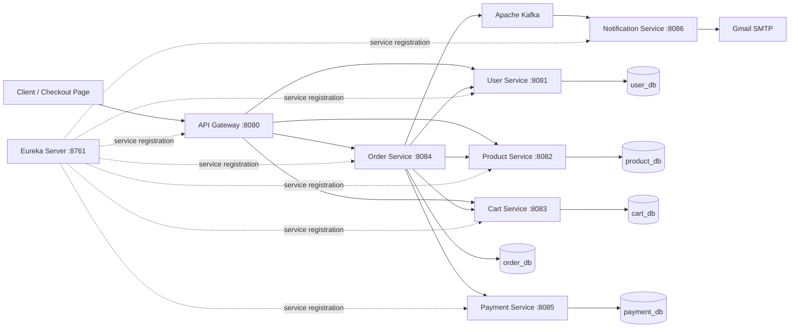

# E-Commerce Microservices Backend

An event-driven e-commerce backend built with Java and Spring Boot. The project separates authentication, catalogue, cart, checkout, payment, and notification responsibilities into independently runnable services connected through Spring Cloud.

## Highlights

- Eight Spring Boot applications with service discovery and centralized API routing
- JWT authentication with `CUSTOMER` and `ADMIN` authorization rules
- Database-per-service design using MySQL
- Synchronous service communication through OpenFeign and Eureka
- Concurrency-safe stock reservation using pessimistic and optimistic locking
- Order snapshots that preserve the purchased product name, image, quantity, and price
- Razorpay Test Mode integration for payment creation, verification, and refunds
- Kafka-based asynchronous order-confirmation notifications
- Validation, centralized error responses, Actuator health endpoints, and automated tests

## Architecture



## Services

| Application | Port | Responsibility | Database |
|---|---:|---|---|
| Discovery Server | `8761` | Eureka service registry | — |
| API Gateway | `8080` | Routing, JWT validation, and authorization | — |
| User Service | `8081` | Registration, login, users, roles, and addresses | `user_db` |
| Product Service | `8082` | Product catalogue, images, search, and stock | `product_db` |
| Cart Service | `8083` | Customer cart and checkout-cart data | `cart_db` |
| Order Service | `8084` | Checkout orchestration, orders, and cancellation | `order_db` |
| Payment Service | `8085` | Razorpay orders, payment verification, and refunds | `payment_db` |
| Notification Service | `8086` | Kafka event consumption and confirmation email | — |

## Technology Stack

- Java 17
- Spring Boot 4.1
- Spring Cloud Gateway MVC, Eureka, OpenFeign, and LoadBalancer
- Spring Data JPA and Hibernate
- MySQL 8
- Apache Kafka
- Razorpay Java SDK
- JWT (JJWT) and BCrypt password hashing
- MapStruct and Lombok
- Maven Wrapper
- JUnit 5, Mockito, MockMvc, and H2 for tests

## Core Workflows

### Authentication and authorization

- JWT authentication with `CUSTOMER` and `ADMIN` roles.
- Passwords are stored using BCrypt.
- API Gateway validates tokens and securely forwards user identity.
- Product updates require `ADMIN`; customers access only their own data.

### Checkout and stock reservation

- Order Service validates the customer and cart.
- Product Service safely reserves stock using database locking.
- Orders preserve product and price details.
- Failed checkout restores reserved stock.

### Payment and cancellation

- Razorpay handles payment creation, verification, and refunds.
- Successful payment confirms the order and clears the cart.
- Cancelling a confirmed order refunds payment and restores stock.
- Shipped and delivered orders cannot be cancelled.

### Kafka notification

- Order confirmation publishes a Kafka event.
- Notification Service consumes it and sends an email asynchronously.

## Data Consistency

- Optimistic and pessimistic locking prevent conflicting stock and order updates.
- Order snapshots preserve historical product details.
- Unique constraints prevent duplicate users, cart items, and payments.

## Prerequisites

- Java 17
- Maven 3.9+
- MySQL 8
- Apache Kafka
- Razorpay Test credentials
- Gmail App Password for email notifications

## Local Setup

### 1. Create the databases

```sql
CREATE DATABASE user_db;
CREATE DATABASE product_db;
CREATE DATABASE cart_db;
CREATE DATABASE order_db;
CREATE DATABASE payment_db;
```

Hibernate currently manages the development schema through `spring.jpa.hibernate.ddl-auto=update`.

### 2. Configure environment variables

No real credentials are stored in the repository.

| Variable | Used by | Description |
|---|---|---|
| `DB_URL` | User, Product, Cart, Order, Payment | JDBC URL for that service's database |
| `DB_USERNAME` | User, Product, Cart, Order, Payment | MySQL username |
| `DB_PASSWORD` | User, Product, Cart, Order, Payment | MySQL password |
| `JWT_SECRET` | User, API Gateway | Same Base64-encoded signing secret in both applications |
| `RAZORPAY_KEY_ID` | Payment | Razorpay Test Mode key ID |
| `RAZORPAY_KEY_SECRET` | Payment | Razorpay Test Mode key secret |
| `KAFKA_BOOTSTRAP_SERVERS` | Order, Notification | Kafka address, for example `localhost:9092` |
| `ORDER_CONFIRMED_TOPIC` | Order, Notification | Optional; defaults to `order-confirmed` |
| `KAFKA_GROUP_ID` | Notification | Optional; defaults to `notification-service-group` |
| `MAIL_USERNAME` | Notification | Gmail sender address |
| `MAIL_APP_PASSWORD` | Notification | Gmail App Password, not the normal account password |

`DB_URL`, `DB_USERNAME`, and `DB_PASSWORD` must be configured separately for each database-backed service. IDE run configurations or separate terminal sessions can provide service-specific values.

Example for User Service in PowerShell:

```powershell
$env:DB_URL = "jdbc:mysql://localhost:3306/user_db"
$env:DB_USERNAME = "<mysql-username>"
$env:DB_PASSWORD = "<mysql-password>"
$env:JWT_SECRET = "<base64-jwt-secret>"

cd user-service
.\mvnw.cmd spring-boot:run
```

Use the same `JWT_SECRET` for User Service and API Gateway. Never commit actual credentials.

### 3. Start Kafka

Start a Kafka broker and create the notification topic if it does not already exist:

```powershell
cd C:\kafka\kafka_2.13-4.3.1

.\bin\windows\kafka-topics.bat --create --if-not-exists `
  --topic order-confirmed `
  --bootstrap-server localhost:9092 `
  --partitions 1 `
  --replication-factor 1
```

### 4. Start the applications

Run every application in its own terminal or IDE run configuration.

Recommended startup order:

1. MySQL and Kafka
2. Discovery Server
3. User, Product, Cart, and Payment services
4. Order and Notification services
5. API Gateway

Generic Maven Wrapper command:

```powershell
cd <service-directory>
.\mvnw.cmd spring-boot:run
```

After startup:

- Eureka dashboard: `http://localhost:8761`
- API Gateway: `http://localhost:8080`
- Demo checkout page: `http://localhost:8080/checkout.html`

## Main API Endpoints

All client-facing APIs should be called through the API Gateway at `http://localhost:8080`.

| Method | Endpoint | Access | Purpose |
|---|---|---|---|
| `POST` | `/api/auth/register` | Public | Register a customer |
| `POST` | `/api/auth/login` | Public | Login and receive JWT |
| `GET` | `/api/products` | Public | List active products |
| `GET` | `/api/products/{id}` | Public | Get a product |
| `GET` | `/api/products/search` | Public | Search products |
| `POST` | `/api/products` | Admin | Create a product |
| `PUT` | `/api/products/{id}` | Admin | Update a product |
| `DELETE` | `/api/products/{id}` | Admin | Deactivate a product |
| `POST` | `/api/cart` | Customer | Add or increase a cart item |
| `GET` | `/api/cart` | Customer | View cart |
| `DELETE` | `/api/cart/items/{productId}` | Customer | Remove an item |
| `DELETE` | `/api/cart` | Customer | Clear cart |
| `POST` | `/api/orders` | Customer | Start checkout and create Razorpay Order |
| `POST` | `/api/orders/payments/verify` | Customer | Verify payment and confirm order |
| `GET` | `/api/orders` | Customer | List authenticated customer's orders |
| `GET` | `/api/orders/{orderId}` | Customer | Get an owned order |
| `PUT` | `/api/orders/{orderId}/cancel` | Customer | Cancel and refund a confirmed order |

Payment and stock-management endpoints are service-to-service APIs and are not exposed as public Gateway routes.

For protected requests:

```http
Authorization: Bearer <jwt-token>
```

## Build and Test

Each service is an independent Maven project:

```powershell
cd <service-directory>
.\mvnw.cmd clean test
```

Tests use JUnit 5, Mockito, MockMvc, and H2 where applicable. External systems such as Gmail and Kafka are mocked or disabled in focused unit tests.

## Project Structure

```text
ecommerce-microservices/
├── api-gateway/
├── cart-service/
├── discovery-server/
├── notification-service/
├── order-service/
├── payment-service/
├── product-service/
└── user-service/
```

## Planned Improvements

- Flyway database migrations
- Docker Compose deployment
- Razorpay webhook processing
- Expiry and stock release for abandoned pending checkouts
- Kafka retry and dead-letter handling
- Distributed tracing and structured logging
- Pagination and OpenAPI documentation

## Project Status

This repository is a backend portfolio project focused on microservice boundaries, secure authentication, checkout consistency, payment integration, and event-driven notifications. Local infrastructure and provider credentials are required to run the complete end-to-end flow.
