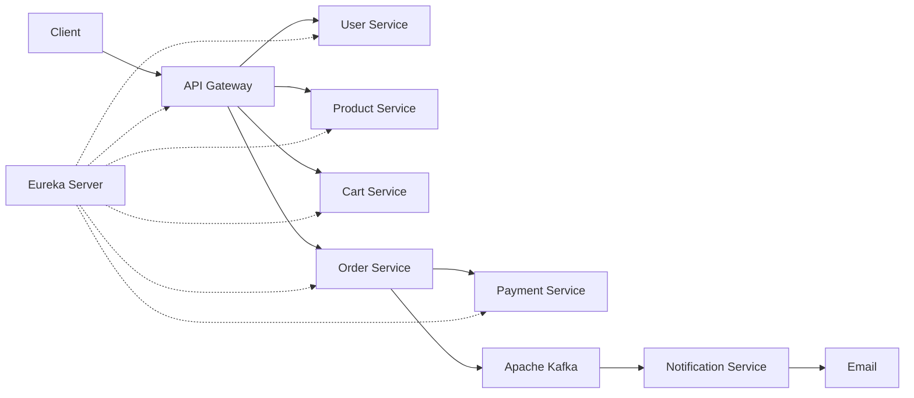

# E-Commerce Microservices Backend

An event-driven e-commerce backend built with Java and Spring Boot. The project separates authentication, catalogue, cart, checkout, payment, and notification responsibilities into independently runnable services connected through Spring Cloud.

## Highlights

- Eight Spring Boot applications with service discovery and centralized API routing
- JWT authentication with `CUSTOMER` and `ADMIN` authorization rules
- Database-per-service design using MySQL
- Synchronous service communication through OpenFeign and Eureka
- Safely manages product stock when multiple customers place orders at the same time
- Razorpay Test Mode integration for payment creation, verification, and refunds
- Kafka-based asynchronous order-confirmation notifications
- Validation, centralized error responses, and Actuator health endpoints

## Architecture

## Services

| Application | Port | Responsibility | Database |
|---|---:|---|---|
| Discovery Server | `8761` | Eureka service registry | — |
| API Gateway | `8080` | Routing, JWT validation, and authorization | — |
| User Service | `8081` | Registration, login, users, roles, and addresses | `user_db` |
| Product Service | `8082` | Product catalogue, images, search, and stock | `product_db` |
| Cart Service | `8083` | Customer cart and checkout-cart data | `cart_db` |
| Order Service | `8084` | Checkout orchestration, orders, and cancellation | `order_db` |
| Payment Service | `8085` | Razorpay orders, payment verification, and refunds | `payment_db` |
| Notification Service | `8086` | Kafka event consumption and confirmation email | — |

## Technology Stack

- Java 17
- Spring Boot 4.1
- Spring Cloud Gateway MVC, Eureka, OpenFeign, and LoadBalancer
- Spring Data JPA and Hibernate
- MySQL 8
- Apache Kafka
- Razorpay Java SDK
- JWT (JJWT) and BCrypt password hashing
- MapStruct and Lombok
- Maven Wrapper
- JUnit 5 and Mockito
