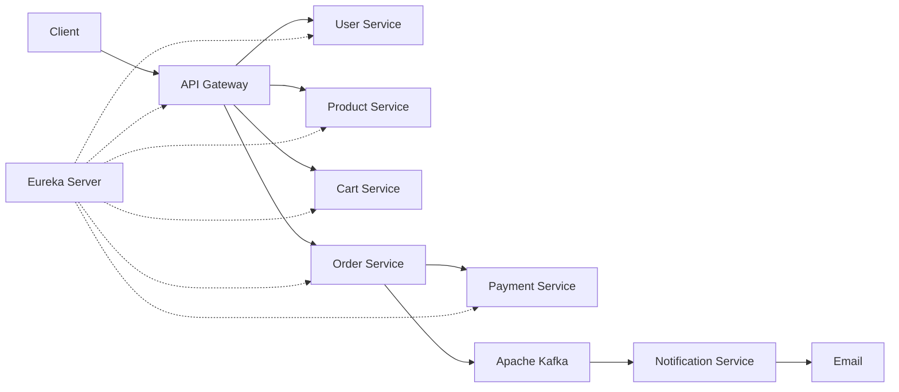

# E-Commerce Microservices Backend

An event-driven e-commerce backend built with Java and Spring Boot. The project separates authentication, catalogue, cart, checkout, payment, and notification responsibilities into independently runnable services connected through Spring Cloud.

## Highlights

- Eight Spring Boot applications with service discovery and centralized API routing
- JWT authentication with `CUSTOMER` and `ADMIN` authorization rules
- Database-per-service design using MySQL
- Synchronous service communication through OpenFeign and Eureka
- Concurrency-safe stock reservation using pessimistic and optimistic locking
- Order snapshots that preserve the purchased product name, image, quantity, and price
- Razorpay Test Mode integration for payment creation, verification, and refunds
- Kafka-based asynchronous order-confirmation notifications
- Validation, centralized error responses, Actuator health endpoints, and automated tests

## Architecture



## Services

| Application | Port | Responsibility | Database |
|---|---:|---|---|
| Discovery Server | `8761` | Eureka service registry | — |
| API Gateway | `8080` | Routing, JWT validation, and authorization | — |
| User Service | `8081` | Registration, login, users, roles, and addresses | `user_db` |
| Product Service | `8082` | Product catalogue, images, search, and stock | `product_db` |
| Cart Service | `8083` | Customer cart and checkout-cart data | `cart_db` |
| Order Service | `8084` | Checkout orchestration, orders, and cancellation | `order_db` |
| Payment Service | `8085` | Razorpay orders, payment verification, and refunds | `payment_db` |
| Notification Service | `8086` | Kafka event consumption and confirmation email | — |

## Technology Stack

- Java 17
- Spring Boot 4.1
- Spring Cloud Gateway MVC, Eureka, OpenFeign, and LoadBalancer
- Spring Data JPA and Hibernate
- MySQL 8
- Apache Kafka
- Razorpay Java SDK
- JWT (JJWT) and BCrypt password hashing
- MapStruct and Lombok
- Maven Wrapper
- JUnit 5, Mockito, MockMvc, and H2 for tests

## Core Workflows

### Authentication and Authorization

- JWT authentication with `CUSTOMER` and `ADMIN` roles
- Passwords are stored using BCrypt
- API Gateway validates tokens and securely forwards user identity
- Product updates require `ADMIN`; customers access only their own data

### Checkout and Stock Reservation

- Order Service validates the customer and cart
- Product Service safely reserves stock using database locking
- Orders preserve product and price details
- Failed checkout restores reserved stock

### Payment and Cancellation

- Razorpay handles payment creation, verification, and refunds
- Successful payment confirms the order and clears the cart
- Cancelling a confirmed order refunds payment and restores stock
- Shipped and delivered orders cannot be cancelled

### Kafka Notification

- Order confirmation publishes a Kafka event
- Notification Service consumes it and sends an email asynchronously

## Data Consistency

- Optimistic and pessimistic locking prevent conflicting stock and order updates
- Order snapshots preserve historical product details
- Unique constraints prevent duplicate users, cart items, and payments

## Prerequisites

- Java 17
- Maven 3.9+
- MySQL 8
- Apache Kafka
- Razorpay Test credentials
- Gmail App Password for email notifications

## Run Locally

Sensitive configuration is provided through environment variables and is not stored in the repository.

Recommended startup order:

1. MySQL and Kafka
2. Discovery Server
3. User, Product, Cart, and Payment services
4. Order and Notification services
5. API Gateway

## Main API Endpoints

All client-facing APIs should be called through the API Gateway at `http://localhost:8080`.

| Method | Endpoint | Access | Purpose |
|---|---|---|---|
| `POST` | `/api/auth/register` | Public | Register a customer |
| `POST` | `/api/auth/login` | Public | Login and receive JWT |
| `GET` | `/api/products` | Public | List active products |
| `GET` | `/api/products/{id}` | Public | Get a product |
| `GET` | `/api/products/search` | Public | Search products |
| `POST` | `/api/products` | Admin | Create a product |
| `PUT` | `/api/products/{id}` | Admin | Update a product |
| `DELETE` | `/api/products/{id}` | Admin | Deactivate a product |
| `POST` | `/api/cart` | Customer | Add or increase a cart item |
| `GET` | `/api/cart` | Customer | View cart |
| `DELETE` | `/api/cart/items/{productId}` | Customer | Remove an item |
| `DELETE` | `/api/cart` | Customer | Clear cart |
| `POST` | `/api/orders` | Customer | Start checkout and create Razorpay Order |
| `POST` | `/api/orders/payments/verify` | Customer | Verify payment and confirm order |
| `GET` | `/api/orders` | Customer | List the authenticated customer's orders |
| `GET` | `/api/orders/{orderId}` | Customer | Get an owned order |
| `PUT` | `/api/orders/{orderId}/cancel` | Customer | Cancel and refund a confirmed order |

## Project Structure

```text
ecommerce-microservices/
├── api-gateway/
├── cart-service/
├── discovery-server/
├── notification-service/
├── order-service/
├── payment-service/
├── product-service/
└── user-service/
```

## Planned Improvements

- Flyway database migrations
- Docker Compose deployment
- Razorpay webhook processing
- Expiry and stock release for abandoned pending checkouts
- Kafka retry and dead-letter handling
- Distributed tracing and structured logging
- Pagination and OpenAPI documentation

## Project Status

This repository is a backend portfolio project focused on microservice boundaries, secure authentication, checkout consistency, payment integration, and event-driven notifications. Local infrastructure and provider credentials are required to run the complete end-to-end flow.
